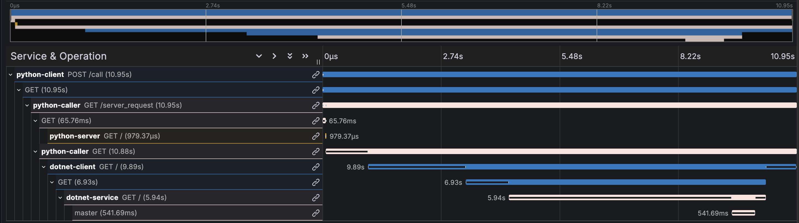

# Multi-language OpenTelemetry Demo

**Repo Owner**: Tin Trung Ngo

## Before you begin

This repository contains image build artifacts for a demo application of OpenTelemetry Instrumentation in Kubernetes environment that utilizes [OpenTelemetry Operator](https://github.com/open-telemetry/opentelemetry-operator).

For Amazon ECS, it is normally recommended to use AWS Distro for OpenTelemetry (ADOT) collector for container instrumentation. The images in this repository use the original open-source OpenTelemetry Collector instead of ADOT collector.

 

## Architecture

This demo application's worklow has the following order:
1. Python Web Client calls Python Caller
2. Python Caller calls Python Server and triggers .NET Client
3. Python Server respond Python Caller (1)
4. .NET Client calls .NET Server
5. .NET Server queries Microsoft SQL Server and then respond .NET Client
6. .NET Client respond Python Caller (2)
7. Python Caller respond Python Web Client (1 + 2)

 
